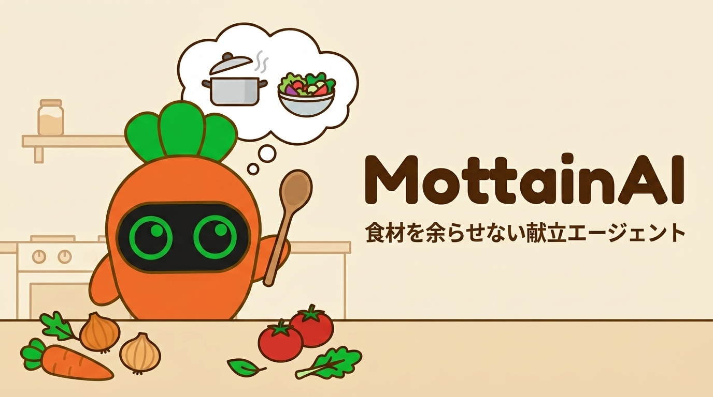
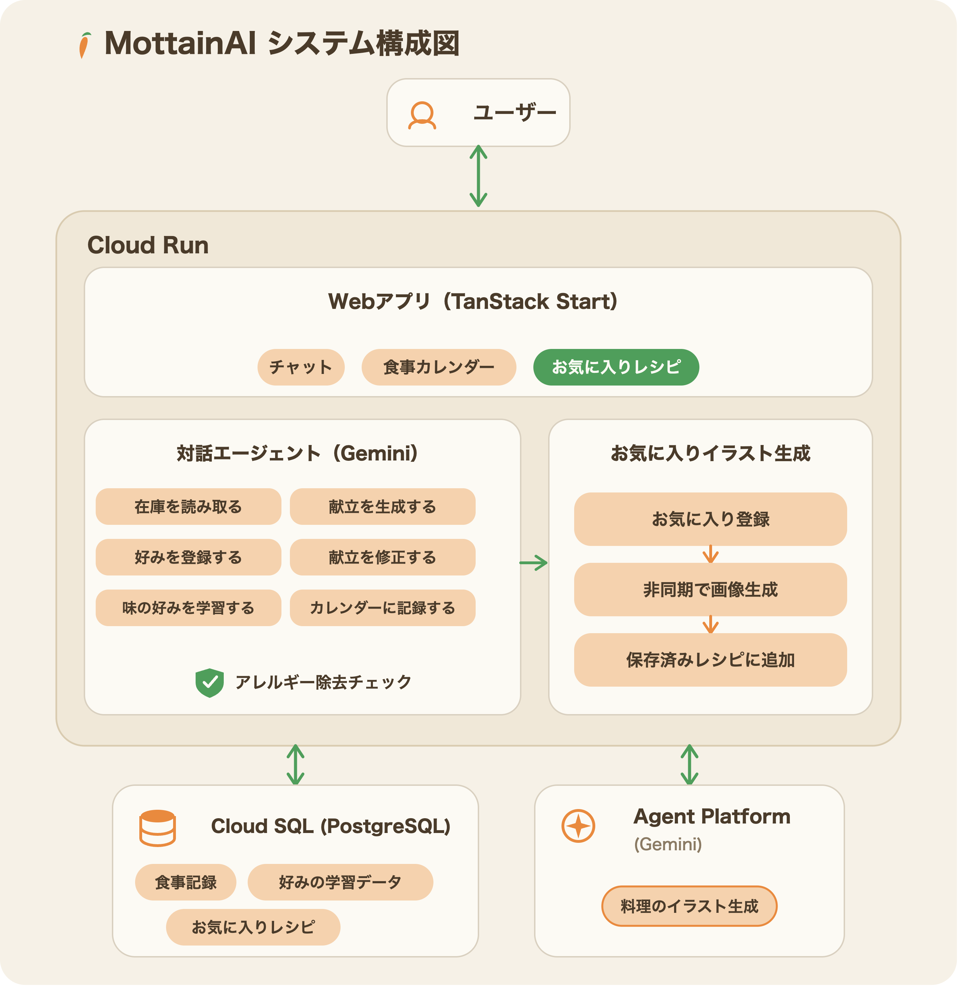
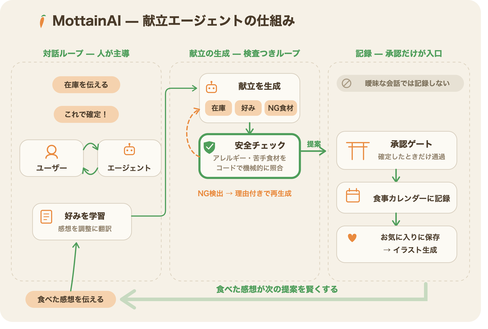

# MottainAI

食材を無駄にしない献立づくりを、AI エージェントとのチャットで実現する Web アプリ。

「冷蔵庫にじゃがいもと人参がある。3日分の夕食を考えて」——そのような自然な一言から、手持ち食材を余らせない献立と、不足分だけの買い物リストを提案する。

## 解決する課題

- 冷蔵庫の食材をどう余らせずに使うか考えるのが面倒
- 献立を考えるのに時間がかかる
- 何を買い足せばいいかわからない
- アレルギーや苦手食材を毎回気にしながら考えるのが手間

## ターゲット

家庭で食事を作る個人・世帯（MVP: 単一ユーザー・単一世帯）。

## コアバリュー

**AI エージェントが価値の中心**。単なるレシピ検索やチャットボットではなく、エージェントが自律的に判断・ツールを活用し、献立全体で食材が余らないよう最適化する。提案の根拠（どの食材を優先的に消費しようとしているか、何を避けているか、どの好みを反映したか）をユーザーが追えることで信頼性を担保する。

## システム構成

Web アプリ・対話エージェント・回避ガードはすべて **Cloud Run 上の 1 サービス**として動作する（フロントとバックエンドを分離しない）。Cloud Run は Cloud SQL（PostgreSQL）と Gemini の 2 つの外部サービスにのみ接続する、シンプルな 2 層構成にしている。

- **Cloud Run**: TanStack Start（React・SSR）による Web アプリ（チャット・食事カレンダー・お気に入り）と、対話エージェント・API・回避ガードを同居させる
- **Cloud SQL（PostgreSQL）**: 食事記録・好みの学習データ・お気に入りレシピを永続化する
- **Gemini**: 対話・献立生成・好みの学習・レシピイラスト生成のすべてを担う唯一の外部 AI サービス

インフラの設計判断は [ADR-04](docs/adr/04-infra-cloud-run.md)・[ADR-06](docs/adr/06-ai-core-gemini-enterprise-agent-platform.md) を参照。

## エージェントの設計

このプロダクトの核は、単一の対話エージェントに閉じずに、**役割ごとに異なる設計パターンを使い分けている**ことにある。

### 1. 対話 — Human-in-the-Loop

献立の提案は一度で確定させない。ユーザーが「もう少しパンチが欲しい」「魚料理に変えて」といった感想・修正依頼を挟みながら、エージェントが再提案を繰り返す。人間の反応そのものが次の生成の入力になる、対話主導のループになっている。

### 2. 献立生成 — Evaluator-Optimizer（簡易版）

献立生成は「LLM が生成 → コード側の決定論的なガードで安全性を検査 → 違反があれば理由付きで再生成」という評価つきのループになっている。本来の Evaluator-Optimizer は評価者も LLM が担うが、ここでは評価者を LLM ではなくコードに置き換えた簡易版にしている。アレルギー・苦手食材のような機械的に判定できる安全性要件は、確率的な LLM の自己申告に任せず、確実な文字列照合で担保する。再生成後もなお違反が残った場合は隠さずユーザーに開示する。

### 3. 記録 — 承認ゲート付き Tool Use

食事カレンダーへの記録（DB への書き込み）は、ユーザーが確定の意思をはっきり示したときだけ実行される。「良さそう」「まだ迷う」といった曖昧な発話では発火せず、不可逆な副作用の前に必ず人間の承認を経由するゲートとして設計している。

### 継続学習ループ

「パンチが足りない」のような抽象的な感想は、エージェントが具体的な調整指示（辛味を足す、酸味を抑える 等）に翻訳して記憶し、次回以降の献立生成に反映される。使えば使うほど、その人の味の好みに寄っていく仕組みになっている。

## MVP スコープ

- チャットで在庫（食材・調味料）を自然な発話で伝えると、エージェントが構造化して把握する
- 指定した日数分（1〜7日）の夕食献立と、手持ちで不足するぶんだけの買い物リストを提案する
- アレルギー・苦手食材は絶対に混入しない（ガードレール）
- 世帯人数・子供の年齢帯に合わせた分量
- チャットで献立を修正・改善できる
- 提案の根拠（優先的に消費する食材・回避食材・好み反映）を確認できる
- 味の感想（「パンチが足りない」など抽象的なコメントも可）から好みを学習し、次回以降の提案に反映する
- 気に入ったレシピを保存できる
- レシピのイラストを生成できる（確定または明示要求時のみ——試行錯誤中の無駄な再生成を避ける）

## MVP 対象外

- 朝食・昼食・3食対応（夕食のみ）
- 複数世帯・ユーザー管理
- 栄養計算・カロリー管理
- 在庫ごとの消費期限管理（一般的な日持ちのみ考慮）
- モバイルアプリ（Web のみ。モバイル最適化は余裕があれば任意）

## 差別化ポイント

| ポイント       | 内容                                                                                           |
| -------------- | ---------------------------------------------------------------------------------------------- |
| 透明性         | 提案の根拠を常に確認できる。なぜこの献立なのかがわかる                                         |
| ガードレール   | アレルギー・苦手食材は、食材を余らせない最適化や好みより優先され、絶対に混入しない             |
| 好みの学習     | 「パンチが足りない」などの抽象的な感覚から具体的な改善案（調味料・分量の調整）を提示し学習する |
| 余剰の持ち越し | 買い物リストより多く買った分は次回の手持ち在庫として自動的に持ち越される                       |

## プロダクト前提

- GCP ハッカソン作品。デプロイ先は Cloud Run（[ADR-04](docs/adr/04-infra-cloud-run.md)）
- Web アプリとして提供する。モバイル対応は範囲外（余裕があれば任意）
- AI コアは Gemini Enterprise Agent Platform / Gemini を使用（[ADR-06](docs/adr/06-ai-core-gemini-enterprise-agent-platform.md)）
- 過剰な作り込みを避け、個人開発で回せる軽さを保つ（[開発憲章](.specify/memory/constitution.md) 原則 I）

---

## 開発・デプロイ

ローカル開発環境のセットアップ、Terraform によるインフラ管理、Cloud Run への自動デプロイの手順は [docs/development.md](docs/development.md) を参照。
